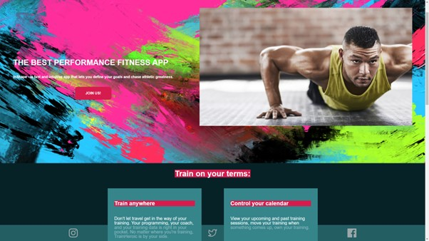

# InShape

<b>InShape</b> is a full-stack web application for coaches and athletes. After logging in, the user can search different exercises, create their own workout and notes. 

 <h3>
    <a href="https://youtu.be/xlalhPPA1Zw">View Demo Here</a>
  </h3>
  
  
  
## InShape is a website that uses the MERN stack:

MongoDB - A document databsase that stores each unique user and their workout.

Express.js - A webframework for Node.js, used in back-end.

React.js - A client-side JavaScript framework that allows smooth webpage transitions and an easy user experience.

Node.js - A JavaScript based, open source server environment that adds, deletes and modifies data in the MongoDB.

## APIs involved:

<b>InShape</b> uses the power of Auth0 - (https://auth0.com/) to verify users via their google accounts. 

## About:

<b>InShape</b> is a Concordia Web Development Bootcamp final project, soon to be hosted on GitPages for all to use.

Project Link:  https://github.com/sergienkoanna777/InShape
